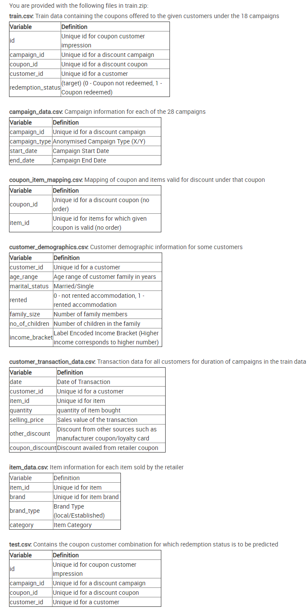

# [AmExpert-2019-Machine-Learning-Hackathon](https://datahack.analyticsvidhya.com/contest/amexpert-2019-machine-learning-hackathon)

 Machine Learning Hackathon
 
  ```python
 #  Feature Engenering
data['campaign_id_exp_co'] = expanding_count(data['campaign_id']) # 1 No
data['coupon_id_exp_co'] = expanding_count(data['coupon_id']) # 2 No
data['customer_id_exp_co'] = expanding_count(data['customer_id']) # 3 No
data['rented_count'] = data['customer_id'].map(feature(customer_demographics, 'customer_id','rented','sum'))# 4 No
 ```
 
 
 
 
 [`DAY - 1`](./Day-1)
 

 
| `Experiment name`  | `MODEL`  | `CV`  | `LB` |`Note`|
| ----------- | ----------- |----------- |----------- |----------- |
| 10 fold lightgbm SKFold       |LightGbm       |0.823346822002498       |0.723262091750793       |Title       |
| 2      | Title       |Title       |Title       |Title       |Title       |


 [`DAY - 2`](./Day-2)
  

| `Experiment name`  | `MODEL`  | `CV`  | `LB` |`Note`|`Args`|
| ----------- | ----------- |----------- |----------- |----------- |----------- |
| 1      | Title       |Title       |Title       |Title       |Title       |
| 2      | Title       |Title       |Title       |Title       |Title       |


 [`DAY - 3`](./Day-3)
  

| `Experiment name`  | `MODEL`  | `CV`  | `LB` |`Note`|`Args`|
| ----------- | ----------- |----------- |----------- |----------- |----------- |
| 1      | Title       |Title       |Title       |Title       |Title       |
| 2      | Title       |Title       |Title       |Title       |Title       |


 [`DAY - 4`](./Day-4)
  

| `Experiment name`  | `MODEL`  | `CV`  | `LB` |`Note`|`Args`|
| ----------- | ----------- |----------- |----------- |----------- |----------- |
| 1      | Title       |Title       |Title       |Title       |Title       |
| 2      | Title       |Title       |Title       |Title       |Title       |


 [`DAY - 5`](./Day-5)
  

| `Experiment name`  | `MODEL`  | `CV`  | `LB` |`Note`|`Args`|
| ----------- | ----------- |----------- |----------- |----------- |----------- |
| 1      | Title       |Title       |Title       |Title       |Title       |
| 2      | Title       |Title       |Title       |Title       |Title       |


 [`DAY - 6`](./Day-6)
  

| `Experiment name`  | `MODEL`  | `CV`  | `LB` |`Note`|`Args`|
| ----------- | ----------- |----------- |----------- |----------- |----------- |
| 1      | Title       |Title       |Title       |Title       |Title       |
| 2      | Title       |Title       |Title       |Title       |Title       |


 [`DAY - 7`](./Day-7)
  

| `Experiment name`  | `MODEL`  | `CV`  | `LB` |`Note`|`Args`|
| ----------- | ----------- |----------- |----------- |----------- |----------- |
| 1      | Title       |Title       |Title       |Title       |Title       |
| 2      | Title       |Title       |Title       |Title       |Title       |


 [`DAY - 8`](./Day-8)
  

| `Experiment name`  | `MODEL`  | `CV`  | `LB` |`Note`|`Args`|
| ----------- | ----------- |----------- |----------- |----------- |----------- |
| 1      | Title       |Title       |Title       |Title       |Title       |
| 2      | Title       |Title       |Title       |Title       |Title       |


 [`DAY - 9`](./Day-9)
  

| `Experiment name`  | `MODEL`  | `CV`  | `LB` |`Note`|`Args`|
| ----------- | ----------- |----------- |----------- |----------- |----------- |
| 1      | Title       |Title       |Title       |Title       |Title       |
| 2      | Title       |Title       |Title       |Title       |Title       |
