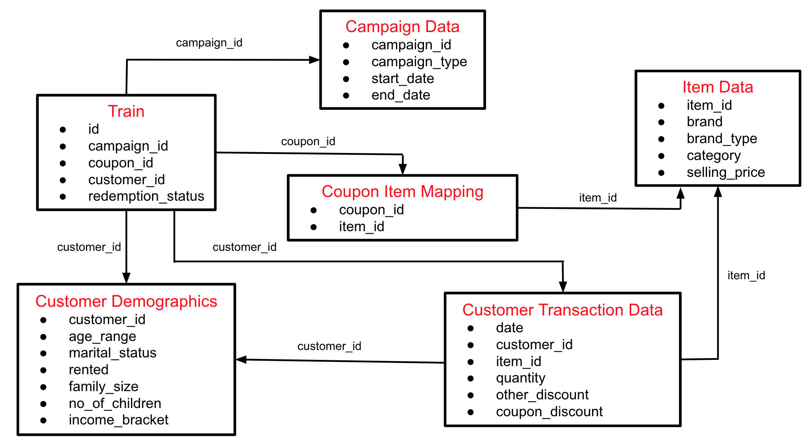

# [AmExpert-2019-Machine-Learning-Hackathon](https://datahack.analyticsvidhya.com/contest/amexpert-2019-machine-learning-hackathon)

 Machine Learning Hackathon
 
  ```python
 #  Feature Engenering
data['campaign_id_exp_co'] = expanding_count(data['campaign_id']) # 1 No
data['coupon_id_exp_co'] = expanding_count(data['coupon_id']) # 2 No
data['customer_id_exp_co'] = expanding_count(data['customer_id']) # 3 No
data['rented_count'] = data['customer_id'].map(feature(customer_demographics, 'customer_id','rented','sum')).\
fillna(0.07964084495607981) # 4 No
#  campaign_id based features
data['campaign_id_count'] = data['campaign_id'].map(data['campaign_id'].value_counts()) #  No
data['coupon_id_count'] = data['coupon_id'].map(data['coupon_id'].value_counts())#  No
data['customer_id_count'] = data['customer_id'].map(data['customer_id'].value_counts())#  No

# rented
rented_mean = customer_demographics.groupby("customer_id")['rented'].mean().to_dict()
data['rented_mean'] = data['customer_id'].map(rented_mean)
# income_bracket
income_bracket_sum = customer_demographics.groupby("customer_id")['income_bracket'].sum().to_dict()
data['income_bracket_sum'] = data['customer_id'].map(income_bracket_sum)
# age_range
age_range_mean = customer_demographics.groupby("customer_id")['age_range'].mean().to_dict()
data['age_range_mean'] = data['customer_id'].map(age_range_mean)
# family_size
family_size_mean = customer_demographics.groupby("customer_id")['family_size'].mean().to_dict()
data['family_size_mean'] = data['customer_id'].map(family_size_mean)
# no_of_children
no_of_children_mean = customer_demographics.groupby("customer_id")['no_of_children'].mean().to_dict()
data['no_of_children_mean'] = data['customer_id'].map(no_of_children_mean)
no_of_children_count = customer_demographics.groupby("customer_id")['no_of_children'].count().to_dict()
data['no_of_children_count'] = data['customer_id'].map(no_of_children_count)
# marital_status
marital_status_count = customer_demographics.groupby("customer_id")['marital_status'].count().to_dict()
data['marital_status_count'] = data['customer_id'].map(marital_status_count)
#############################################################################
#data['difference'] = (data['end_date'] - data['start_date']) / np.timedelta64(1, 'D')
data['end_date_month'] = data['end_date'].dt.month
data['end_date_dayofweek'] = data['end_date'].dt.dayofweek 
# data['end_date_dayofyear'] = data['end_date'].dt.dayofyear 
# data['end_date_days_in_month'] = data['end_date'].dt.days_in_month 
data['start_date_month'] = data['start_date'].dt.month
data['start_date_dayofweek'] = data['start_date'].dt.dayofweek 
# data['start_date_dayofyear'] = data['start_date'].dt.dayofyear 
# data['start_date_days_in_month'] = data['start_date'].dt.days_in_month 
# data['diff_dayofweek'] = data['end_date_dayofweek'] - data['start_date_dayofweek']
# data['diff_dayofyear'] = data['end_date_dayofyear'] - data['start_date_dayofyear']
 ```
  
 
 [`DAY - 1`](./Day-1)
 

 
| `Experiment name`  | `MODEL`  | `CV`  | `LB` |`script`|
| ----------- | ----------- |----------- |----------- |----------- |
| 10 fold lightgbm SKFold|LightGbm|0.823346822002498|0.723262091750793|[script](./Day-1/day_1_sub_1.py)|
| 10 fold lightgbm SKFold|LightGbm|0.90|0.823638085449945|[script](./Day-1/day-1-script-02.py)       |
| 10 fold lightgbm SKFold|LightGbm|0.9019|0.820|[script](./Day-1/day-1-script-03.py)       |
| 10 fold Catboost SKFold|Catboost|0.8844|0.782251894526244|[script](./Day-1/day-1-script-04.py)       |
| 10 fold LR SKFold |LogisticRegression|0.714118745672373|0.652779212300426 |[script](./Day-1/day-1-script-05.py)|
| 10 fold RFClassifier SKFold |RandomForestClassifier|0.826985519407373|0.749643707078551|[script](./Day-1/day-1-script-06.py)|
| 10 fold Neural Network SKFold|Neural Network|0.89|0.784766559598147 |[script](./Day-1/day-1-script-07.py)|


[`DAY - 2`](./Day-2)
 
| `Experiment name`  | `MODEL`  | `CV`  | `LB` |`script`|
| ----------- | ----------- |----------- |----------- |----------- |
| 10 fold lightgbm SKFold       |LightGbm       |0.9350552975642958       |0.524130796162195 |[script](./Day-2/day-2-script-01.py)|
| 10 fold Catboost SKFold       |Catboost       |0.9228868511304172        |0.858604946914161   |[script](./Day-2/day-2-script-02.py)|
| 10 fold lightgbm SKFold       |LightGbm       |0.9310951709368533       |0.522719863441945 |[script](./Day-2/day-2-script-01-1.py)|
| 10 fold Neural Network SKFold|Neural Network|0.8973715008465092|0.82850696157902 |[script](./Day-2/day-2-script-05.py)|
| 10 fold lightgbm SKFold       |LightGbm       |0.921       |0.856898502528373 |[script](./Day-2/day-2-script-01-2.py)|
| 10 fold LR SKFold |LogisticRegression|0.8904360694325838|0.719326611691508 |[script](./Day-2/day-2-script-03.py)|
| 10 fold RFClassifier SKFold |RandomForestClassifier|.90|0.825821535181509|[script](./Day-2/day-2-script-04.py)|
| 10 fold lightgbm SKFold       |Xgboost       |0.922       |0.530971875280263 |[script](./Day-2/day-2-script-06.py)|
| 10 fold LR SKFold |LogisticRegression|0.931816816207497|0.844338034742226 |[script](./Day-2/day-2-script-03-1.py)|


 [`DAY - 3`](./Day-3)
  

 `Experiment name`  | `MODEL`  | `CV`  | `LB` |`script`|
| ----------- | ----------- |----------- |----------- |----------- |
| 10 fold Catboost SKFold       |Catboost       |0.9308        |0.865776922589758   |[script](./Day-3/day-3-script-02.py)|
| 10 fold Neural Network SKFold|Neural Network|0.84|0.7850|[script](./Day-3/day-3-script-05.py)|
| 10 fold LR SKFold |LogisticRegression|0.9320890009072823|0.816381526068571 |[script](./Day-3/day-3-script-03.py)|
| 10 fold LR SKFold |LogisticRegression|0.939574276261373|0.844352061185897 |[script](./Day-3/day-3-script-03-1.py)|
| 10 fold LR SKFold |LogisticRegression|0.9142172910800109|0.796586601175926 |[script](./Day-3/day-3-script-03-2.py)|


 [`DAY - 4`](./Day-4)
  

 `Experiment name`  | `MODEL`  | `CV`  | `LB` |`script`|
| ----------- | ----------- |----------- |----------- |----------- |
| 10 fold LR SKFold |LogisticRegression|0.9314615391099851|0.851458473863422 |[script](./Day-4/day-4-script-03-1.py)|
| 10 fold LR SKFold |LogisticRegression|0.0.9283575376577058|0.845012685430648 |[script](./Day-4/day-4-script-03-2.py)|
| 10 fold Catboost SKFold       |Catboost       |0.9286831462504616        |0.872226005111576   |[script](./Day-4/day-4-script-02.py)|

 [`DAY - 5`](./Day-5)
  

 `Experiment name`  | `MODEL`  | `CV`  | `LB` |`script`|
| ----------- | ----------- |----------- |----------- |----------- |
| 10 fold Neural Network SKFold|Neural Network|0.8956508231411103|0.828661146198473|[script](./Day-5/day-5-script-05.py)|


# `AFTER COMPETITIONS SOLUTIONS `

| `Private Lb`  | `Link`  |
| ----------- | ----------- |
|18th|[`rajat5ranjan`](https://github.com/rajat5ranjan/AV-AmExpert-2019-ML-Hackathon)|
|67th|[`shravankoninti`](https://github.com/shravankoninti/AV/tree/master/AmExpert%202019%20_MLH_28092019)|
